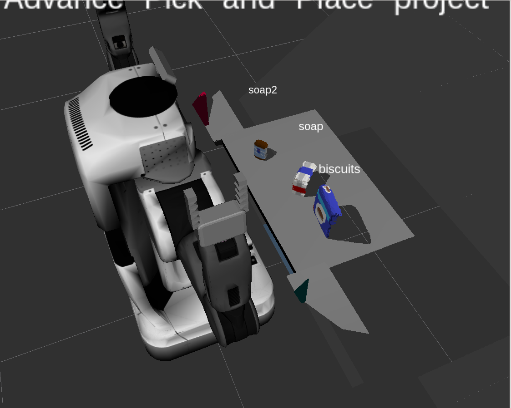

## Project: Perception Pick & Place
### Writeup Template: You can use this file as a template for your writeup if you want to submit it as a markdown file, but feel free to use some other method and submit a pdf if you prefer.

---

# Required Steps for a Passing Submission:
1. Extract features and train an SVM model on new objects (see `pick_list_*.yaml` in `/pr2_robot/config/` for the list of models you'll be trying to identify). 
2. Write a ROS node and subscribe to `/pr2/world/points` topic. This topic contains noisy point cloud data that you must work with.
3. Use filtering and RANSAC plane fitting to isolate the objects of interest from the rest of the scene.
4. Apply Euclidean clustering to create separate clusters for individual items.
5. Perform object recognition on these objects and assign them labels (markers in RViz).
6. Calculate the centroid (average in x, y and z) of the set of points belonging to that each object.
7. Create ROS messages containing the details of each object (name, pick_pose, etc.) and write these messages out to `.yaml` files, one for each of the 3 scenarios (`test1-3.world` in `/pr2_robot/worlds/`).  [See the example `output.yaml` for details on what the output should look like.](https://github.com/udacity/RoboND-Perception-Project/blob/master/pr2_robot/config/output.yaml)  
8. Submit a link to your GitHub repo for the project or the Python code for your perception pipeline and your output `.yaml` files (3 `.yaml` files, one for each test world).  You must have correctly identified 100% of objects from `pick_list_1.yaml` for `test1.world`, 80% of items from `pick_list_2.yaml` for `test2.world` and 75% of items from `pick_list_3.yaml` in `test3.world`.
9. Congratulations!  Your Done!

# Extra Challenges: Complete the Pick & Place
7. To create a collision map, publish a point cloud to the `/pr2/3d_map/points` topic and make sure you change the `point_cloud_topic` to `/pr2/3d_map/points` in `sensors.yaml` in the `/pr2_robot/config/` directory. This topic is read by Moveit!, which uses this point cloud input to generate a collision map, allowing the robot to plan its trajectory.  Keep in mind that later when you go to pick up an object, you must first remove it from this point cloud so it is removed from the collision map!
8. Rotate the robot to generate collision map of table sides. This can be accomplished by publishing joint angle value(in radians) to `/pr2/world_joint_controller/command`
9. Rotate the robot back to its original state.
10. Create a ROS Client for the “pick_place_routine” rosservice.  In the required steps above, you already created the messages you need to use this service. Checkout the [PickPlace.srv](https://github.com/udacity/RoboND-Perception-Project/tree/master/pr2_robot/srv) file to find out what arguments you must pass to this service.
11. If everything was done correctly, when you pass the appropriate messages to the `pick_place_routine` service, the selected arm will perform pick and place operation and display trajectory in the RViz window
12. Place all the objects from your pick list in their respective dropoff box and you have completed the challenge!
13. Looking for a bigger challenge?  Load up the `challenge.world` scenario and see if you can get your perception pipeline working there!

## [Rubric](https://review.udacity.com/#!/rubrics/1067/view) Points

---
### Writeup / README

#### 1. Provide a Writeup / README that includes all the rubric points and how you addressed each one.  You can submit your writeup as markdown or pdf.  

You're reading it!

### Exercise 1, 2 and 3 pipeline implemented
#### 1. Complete Exercise 1 steps. Pipeline for filtering and RANSAC plane fitting implemented.

Exercise 1 was completed by implementing a voxel grid and passthrough filter, followedy by a RANSAC plane segmentation.  These pre-processing steps were done on the initial visual input before clustering and object recognition code.  The voxel grid filter downsampled the visual input to decrease computational processing requirements.  LEAF SIZE was used to find the appropriate downampling amount for retain key data while removing unecessary data.  A passthrough filter acted as a simple rudimentary means of narrowing down the key parts of the visual scene by separating the table and objects from the rest of the world.  A z-axis passthrough between AXIS MIN and AXIS MAX values were used to grab on the table and objects from the world.  RANSAC plane segmentation fitted the table plane in order to extract the table from objects.  Objects were treated as the negative information found in the inliers from RANSAC segmentation.  The MAX DISTANCE variable was used in RANSAC to determine the maximum distance of other cloud points that should be included as an inlier.

#### 2. Complete Exercise 2 steps: Pipeline including clustering for segmentation implemented.  

Euclidean clustering was used to differentiate objects between each other by grabbing cloud points that were neighbors within a certain distance of each other.  Different colors were assigned to each cluster, which differentiated each object with a different color.  CLUSTER TOLERANCE, MIN CLUSTER SIZE, and MAX CLUSTER SIZE were adjusted to optimize clustering.  CLUSTER TOLERANCE was used to determine the distance between cloud points belonging to a particular cluster.  The MIN and MAX CLUSTER SIZE was used to set min and max cloud points for a given cluster.  After clustering is performed, an SVM is applied to predict object identity based on color and normal feature training from individual objects.

#### 2. Complete Exercise 3 Steps.  Features extracted and SVM trained.  Object recognition implemented.

To compute object recognition, color and normal histograms were combined into a feature set that was used to train a support vector model.  In order to create a training set, color and normal histograms were collected from objects at random viewing angles.  Better training accuracy was achieved by increasing the number of viewing angles and, therefore, the number of feature instances the SVM is trained on.   The color histograms allowed for use of the HSV color format, which provides a better indicator of color by separating hue from saturation and intensity.  Separating hue is important since lighting could otherwise affect object recognition by changing the apparent color.  A significant increase in object recognition accuracy was achieved by switching from RGB to HSV.  Normal histograms were also compiled in the direction of the robots perspective to differentiate objects by curvature.  The following normalized and un-normalized confusion matrices were obtained from an SVM trained on 1000 features per object.

### Pick and Place Setup

#### 1. For all three tabletop setups (`test*.world`), perform object recognition, then read in respective pick list (`pick_list_*.yaml`). Next construct the messages that would comprise a valid `PickPlace` request output them to `.yaml` format.

After object recognition code, objects recognized in the scene are submitted to the pick and place routine along with their centroid and intended bin.  These message request parameters were compiled into a yaml.  The following are the object recognition labels for worlds 1 - 3:

Spend some time at the end to discuss your code, what techniques you used, what worked and why, where the implementation might fail and how you might improve it if you were going to pursue this project further.  

One of the most challenging aspects of the project was resolving the disconnect between an SVM that recognized objects with 98% accuracy and the failure to recognize objects with comparable accuracy during the actual Pick and Place task.  The issue was resolved after realizing object predictions were being made using RGB while the SVM was trained on HSV.  Another issue was the inadvertent recognition of bins as objects, which was resolved by removing the periphery from the robots object recognition perspective using a passthrough filter.  Failtures in the implementation could be realized under different lighting due to the dependence on color as a feature of recognition.  While the use of HSV color format reduces the affect of light intensity, the color of lighting (e.g. red or yellow light vs white) may have an impact on object recognition.  This impact may be minimized by training the data set under different lighting conditions.  Futher pursuits with this project could entail additional complexity by adding additional objects and introducing realistic backgrounds outside of the current bland and sterile Pick and Place testing environements.
